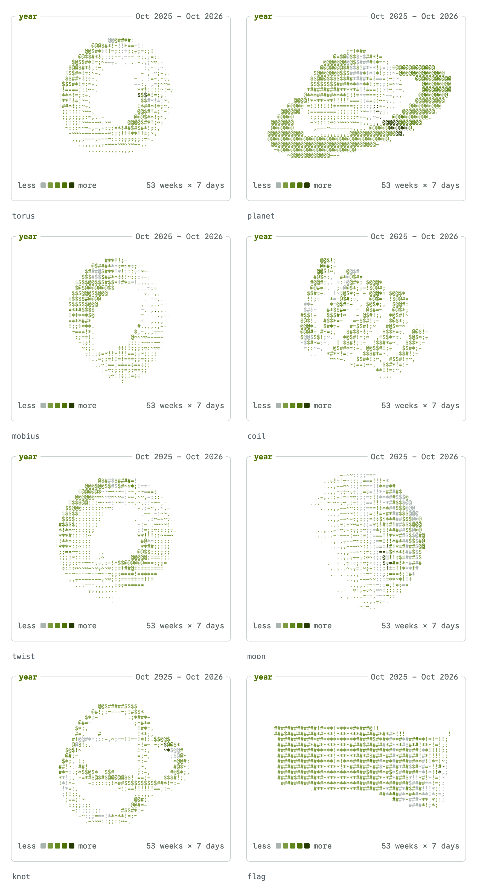

<picture>
  <source media="(prefers-color-scheme: dark)" srcset="docs/preview-dark.png">
  
</picture>

# afterglow

Your GitHub profile as a phosphor terminal dashboard: your year as a spinning
ASCII shape, live panes in the manner of `btop`, your newest posts, and your
links along a powerline status line. Every pane is an animated SVG, redrawn
daily by a GitHub Action from data it fetches.

Above, every pane drawn for one profile (`trends` fills in over days). Live, in
a shorter layout, on [github.com/raelsei](https://github.com/raelsei).

## Quick start

1. Put the markers where the dashboard should go in your profile README
   (`<you>/<you>/README.md`):

   ```md
   <!-- afterglow:start -->
   <!-- afterglow:end -->
   ```

2. Add `.github/workflows/afterglow.yml`:

   ```yaml
   name: afterglow

   on:
     schedule:
       - cron: "17 3 * * *"
     workflow_dispatch:
     push:
       branches: [main]

   permissions:
     contents: write

   concurrency:
     group: afterglow
     cancel-in-progress: true

   jobs:
     draw:
       runs-on: ubuntu-latest
       timeout-minutes: 10
       steps:
         - uses: actions/checkout@v5

         - uses: raelsei/afterglow@v3
           with:
             shape: planet
             feed: https://your.site/rss.xml

         # Images first, so the README never points at files that are not there yet.
         - uses: peaceiris/actions-gh-pages@v4
           with:
             github_token: ${{ secrets.GITHUB_TOKEN }}
             publish_dir: ./afterglow
             publish_branch: output
             force_orphan: true
             commit_message: "afterglow: redraw"

         - name: Commit the README when it changed
           run: |
             git diff --quiet README.md && exit 0
             git config user.name "github-actions[bot]"
             git config user.email "41898282+github-actions[bot]@users.noreply.github.com"
             git add README.md
             git commit -m "afterglow: redraw"
             git pull --rebase
             git push
   ```

3. Run it once from the Actions tab. It redraws daily after that.

With no inputs it draws what it finds on your profile; a `feed` adds the posts pane.

## Panes

| Pane       | Shows                                                                                                    |
| ---------- | -------------------------------------------------------------------------------------------------------- |
| `year`     | Your contribution calendar as a spinning ASCII [shape](#shapes).                                         |
| `whoami`   | Your name, a few lines about you, and the year in figures: total, peak, busiest weekday, streak.         |
| `activity` | Contributions per day as a dot-matrix graph that scrolls a day at a time.                                |
| `posts`    | The newest posts from an RSS or Atom feed.                                                               |
| `langs`    | Languages of the public repositories you committed to, weighted by your commits.                         |
| `top`      | Those repositories, most commits first.                                                                  |
| `contribs` | Your contributions by kind: commits, PRs, reviews, issues, and those in private repositories.            |
| `pinned`   | Your pinned repositories with language, stars and description.                                           |
| `prs`      | Your newest merged pull requests.                                                                        |
| `grid`     | Your contribution calendar as GitHub draws it, a cursor stepping across the weeks.                       |
| `neofetch` | Your profile as neofetch prints a machine, your year's [shape](#shapes) for a logo.                      |
| `releases` | The latest release of each of your public repositories, newest first, whatever the `year`.               |
| `log`      | Your newest commits as `git log --oneline` prints them, across your busiest public repositories.         |
| `clock`    | When you commit, as GitHub's old punch card: weekday by hour in your `timezone`.                         |
| `trends`   | Stars, followers and contributions over 90 days as sparklines. Fills a day at a time from the first run. |

`bar` is the powerline status line: your session name, one segment per link, and the day it was drawn.

## Shapes

`shape` picks what the `year` pane draws. Each day is raised by its count and
inked by its contribution level, shaded like
[donut.c](https://www.a1k0n.net/2011/07/20/donut-math.html). A shape that
closes on itself is made of the newest whole weeks, so the year's two part
weeks meet as one and no slot is drawn without a day; `coil` and `flag` keep
GitHub's weeks and, like GitHub, leave out the days past either end.

| Shape             | The year as                                                                                                             |
| ----------------- | ----------------------------------------------------------------------------------------------------------------------- |
| `torus` (default) | a torus: weeks around the ring, days around the tube.                                                                   |
| `planet`          | a ringed planet: weeks around the equator, days from pole to pole, and each week's busiest day on the ring.             |
| `mobius`          | a Möbius strip: weeks along the band, days across it, and one half twist.                                               |
| `coil`            | a spring: weeks along the wire from end to end, a turn a quarter, days around the wire.                                 |
| `twist`           | a heptagonal ring: weeks around it, a flat face a weekday, twisted a seventh of a turn a lap so the faces run into one. |
| `moon`            | a moon lit from the side: weeks around the equator, days from pole to pole, and a crater a day, deeper the busier.      |
| `knot`            | a trefoil knot: weeks along the knot, days around its tube.                                                             |
| `flag`            | a banner in the wind: weeks from left to right, Sunday on top, as GitHub draws it.                                      |

<picture>
  <source media="(prefers-color-scheme: dark)" srcset="docs/shapes-dark.png">
  
</picture>

## Layout

`layout` is the grid, one row per line. A row holds one pane across both
columns, or two side by side at one height. A pane left out is off; `bar` on a
line of its own places the status line. This is the default:

```yaml
layout: |
  year      | whoami
  activity  | posts
  langs     | top
  bar
```

- `:compact` or `:full` after a name sizes that pane; `density: compact` sizes
  them all. Compact is about half the height.
- Leave a side empty and the pane above reaches down beside the next row:

  ```yaml
  layout: |
    year | whoami
         | contribs
  ```

- Lists (`posts`, `top`, `pinned`, `prs`, `releases`, `log`) are one image per
  line, so every line is its own link. Two lists in one row, or a list reaching
  down, are drawn as one image and link as a whole.
- On a phone the columns stack, and the pane that floats comes first.

## Inputs

| Input       | Default                                   | What it does                                                                                                                                        |
| ----------- | ----------------------------------------- | --------------------------------------------------------------------------------------------------------------------------------------------------- |
| `user`      | repository owner                          | Whose profile is drawn.                                                                                                                             |
| `token`     | `github.token`                            | Reads the profile over GraphQL. It sees public data only.                                                                                           |
| `theme`     | `phosphor`                                | `phosphor` (green), `amber`, `ice` (blue-white) or `github`.                                                                                        |
| `accent`    | the theme's                               | One `#rrggbb` colour for the accent and the contribution ramp, kept readable on GitHub's dark and light grounds.                                    |
| `effects`   | none                                      | `crt` (scanlines and a faint flicker on every image), `typing` (the `whoami` name types itself in), or both. The motion stops under reduced motion. |
| `shape`     | `torus`                                   | What the `year` pane draws, and `neofetch` for a logo: `torus`, `planet`, `mobius`, `coil`, `twist`, `moon`, `knot` or `flag`.                      |
| `year`      | the last twelve months                    | A calendar year to draw instead, such as `2024`.                                                                                                    |
| `timezone`  | `UTC`                                     | The IANA time zone `clock` reads hours in, such as `Europe/Istanbul`.                                                                               |
| `layout`    | see [Layout](#layout)                     | The grid.                                                                                                                                           |
| `density`   | `full`                                    | `compact` makes every pane compact.                                                                                                                 |
| `whoami`    | name, bio, company, location              | Lines for `whoami`. The first is your name.                                                                                                         |
| `session`   | your login                                | The name at the left of the status line.                                                                                                            |
| `feed`      | none                                      | RSS or Atom feed for `posts`.                                                                                                                       |
| `feed_note` | none                                      | `#` comment lines at the top of `posts`.                                                                                                            |
| `posts`     | `5`                                       | How many posts, 1 to 20.                                                                                                                            |
| `posts_url` | the feed's site                           | Where "all of them at" points.                                                                                                                      |
| `links`     | website and social accounts               | `label url` per line, one status-line segment each. Links past the line's width are left out.                                                       |
| `repos`     | `5`                                       | How many repositories `top` lists, 1 to 20.                                                                                                         |
| `out`       | `afterglow`                               | Where the SVGs are written, with `history.json` for `trends` and a local `preview.html`.                                                            |
| `readme`    | `README.md`                               | Updated between the markers; empty leaves it alone. The block is always in `<out>/README.block.md`.                                                 |
| `base_url`  | `raw.githubusercontent.com/<repo>/output` | Where the README loads the images from.                                                                                                             |

`langs`, `top`, `pinned`, `prs`, `releases`, `log` and `clock` read public
repositories only, as do `neofetch`'s repository figures. A streak shorter than
two days is left out; for a past `year`, it is that year's longest.

## Run it locally

```sh
bun install
GITHUB_TOKEN=$(gh auth token) bun src/main.ts --user <you> --shape mobius --out /tmp/afterglow
open /tmp/afterglow/preview.html
```

Every input is also a flag (`--feed-note`) or an `INPUT_<NAME>` variable.
`preview.html` lays the dashboard out the way GitHub's README column does.
`GITHUB_TOKEN=$(gh auth token) bun run preview -- --user <you> [flags]` draws
every shape with the same flags and serves them side by side on localhost.

Before a pull request: `bun test` and `bun run typecheck`, then `bun run build`.
The action runs `dist/index.mjs`, which is committed; CI fails when it is not
the build of the source beside it.

## How it works

GitHub serves README images through a proxy, strips scripts and styles, and
lets an SVG loaded as an image fetch nothing. So:

- Motion is CSS inside each SVG. The year is 120 frames drawn once and shown
  in turn, each lingering at falling opacity like phosphor. Under
  `prefers-reduced-motion` nothing moves.
- Each SVG carries its own copy of [Google Sans Code](https://github.com/googlefonts/googlesans-code),
  cut down to the characters it draws.
- The layout is floated images on a 28px band, the smallest pitch a phone
  still shows without gaps.
- Each image ships dark and light, and `<picture>` follows the viewer's theme.
- Images are named by their content, because GitHub's CDN caches a name for
  minutes. The `output` branch is force-pushed, and each run carries over the
  images the old README used, so it never points at a missing file. The README
  therefore changes whenever a drawing does, which is most days.
- `history.json` rides on the `output` branch too: a snapshot a day of stars,
  followers and contributions, which `trends` and `neofetch`'s weekly changes read.

## Credits

The luminance ramp and the idea are Andy Sloane's
[donut.c](https://www.a1k0n.net/2011/07/20/donut-math.html); the panes owe
their manners to [btop](https://github.com/aristocratos/btop), tmux and powerline. Google
Sans Code is © The Google Sans Code Project Authors, under the
[SIL Open Font License](fonts/OFL.txt). The phosphor palette is
[koray.dev](https://koray.dev)'s.

## Licence

Code: [MIT](LICENSE). Fonts: [OFL 1.1](fonts/OFL.txt).
