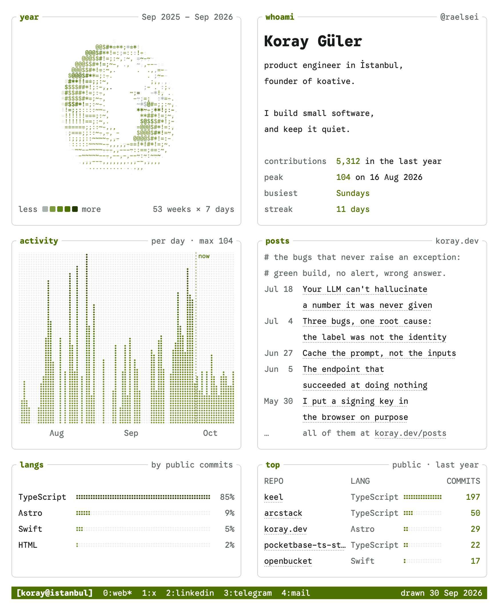

<picture>
  <source media="(prefers-color-scheme: dark)" srcset="docs/preview-dark.png">
  
</picture>

# afterglow

Your GitHub profile as a phosphor terminal dashboard: the year spinning as an
ASCII torus, live panes in the manner of `btop`, your newest posts, and your
links as tmux windows. Every pane is an animated SVG redrawn daily by a GitHub
Action, and every figure in it is fetched, never typed.

Live on [github.com/raelsei](https://github.com/raelsei).

## Panes

| Pane       | What it shows                                                                                                  |
| ---------- | -------------------------------------------------------------------------------------------------------------- |
| `year`     | Your contribution calendar wrapped around a torus and spun like [donut.c](https://www.a1k0n.net/2011/07/20/donut-math.html). |
| `whoami`   | Your name, a few lines about you, and the year in four figures: total, busiest day, busiest weekday, streak.    |
| `activity` | Contributions per day as a dot-matrix graph that scrolls a day at a time, newest on the right.                 |
| `posts`    | The newest posts from an RSS or Atom feed. Every post is its own link.                                          |
| `langs`    | Languages of the public repositories you committed to this year, weighted by your commits.                     |
| `top`      | Those repositories, most commits first. Every row is its own link.                                             |

Below them, a tmux status line: your session name, one window per link, and
the day it was drawn.

## Layout

`layout` is the grid, one row per line. A row holds one pane, which spans both
columns, or two, which share one height so no row leaves half the page empty.
A pane you leave out is off. `bar` on a line of its own places the status line.

```yaml
layout: |
  year      | whoami
  activity  | posts
  langs     | top
  bar
```

That is the default. Every pane also has a compact form, about half the
height: `density: compact` makes them all compact, and `:compact` or `:full`
after a name overrides it for that pane. The compact default above fits in one
laptop screen.

```yaml
density: compact
layout: |
  year:full | whoami:full   # the first row at full size, the rest compact
  posts     | activity
  top
  bar
```

GitHub's Markdown leaves one layout tool, floating images, and it shapes what
a row can be:

- A list (`posts`, `top`) is one image per line so each line can link. It
  flows beside the pane in the other column, on either side.
- Two lists in one row do not fit that way, so the left one is drawn as a
  single image: its lines stop being separate links and the pane links as a
  whole.
- On a narrow screen the columns fall into one. The pane that floats comes
  first, so a row written `posts | activity` shows `activity` first on a
  phone.

## How a year becomes a donut

The contribution calendar is a grid, 53 weeks by 7 days, and a torus is a grid
with both pairs of edges glued together. Weeks go around the ring and weekdays
around the tube, so the year closes on itself: last week sits next to the one a
year ago. Each day lifts the surface by the square root of its count and takes
one of GitHub's five contribution levels as its ink. Every frame is ray-marched
and shaded into donut.c's ramp, `.,-~:;=!*#$@`, and a surface turned away from
the light prints nothing, as in the original.

## Why it is built the way it is

GitHub serves README images through a proxy, strips every script and style
from the Markdown, and an SVG loaded as an image may not fetch anything. So:

- The torus is 120 frames drawn once; one CSS keyframe shows each in turn,
  eight a second, and a frame lingers two more slots at falling opacity, the
  way a phosphor screen fades.
- Every SVG carries its own copy of [Google Sans Code](https://github.com/googlefonts/googlesans-code),
  cut down to the characters it draws.
- The layout is floats. A pane with `align="left"` gets GitHub's 20px padding,
  which is the gutter; `<br clear="all">` ends a row. Everything sits on a 28px
  band, the smallest pitch a phone still shows without gaps once GitHub scales
  a 410px pane into its column.
- Lists are one image per line so each line can be a link, and the box around
  them is drawn a slice at a time.
- Each image ships dark and light files, and `<picture>` follows the viewer's
  GitHub theme. Under `prefers-reduced-motion` nothing moves: the torus holds
  its fullest pose and the graph its newest window.

## Use it

1. Put the markers where the dashboard should go in your profile README
   (`<you>/<you>/README.md`):

   ```md
   <!-- afterglow:start -->
   <!-- afterglow:end -->
   ```

2. Add `.github/workflows/afterglow.yml`:

   ```yaml
   name: afterglow

   on:
     schedule:
       - cron: "17 3 * * *"
     workflow_dispatch:
     push:
       branches: [main]

   permissions:
     contents: write

   concurrency:
     group: afterglow
     cancel-in-progress: true

   jobs:
     draw:
       runs-on: ubuntu-latest
       timeout-minutes: 10
       steps:
         - uses: actions/checkout@v5

         - uses: raelsei/afterglow@v3
           with:
             theme: phosphor
             feed: https://your.site/rss.xml

         # Images first, so the README never points at files that are not there yet.
         - uses: peaceiris/actions-gh-pages@v4
           with:
             github_token: ${{ secrets.GITHUB_TOKEN }}
             publish_dir: ./afterglow
             publish_branch: output
             force_orphan: true
             commit_message: "afterglow: redraw"

         - name: Commit the README when it changed
           run: |
             git diff --quiet README.md && exit 0
             git config user.name "github-actions[bot]"
             git config user.email "41898282+github-actions[bot]@users.noreply.github.com"
             git add README.md
             git commit -m "afterglow: redraw"
             git pull --rebase
             git push
   ```

3. Run it once from the Actions tab. After that it redraws daily, and a push
   made with the workflow's own token does not trigger it again.

With no inputs at all it draws everything it can find on your profile: name,
bio, company, location, website and social accounts. A feed adds the posts
pane.

The images keep their file names and are replaced on the `output` branch,
which is force-pushed, so it never grows a history. The README changes on most
days anyway: each image's alt text says what the image shows, today's figures
included, because an `` gives a screen reader its alt and nothing else.

## Inputs

| Input       | Default                                  | What it does                                                                       |
| ----------- | ---------------------------------------- | ---------------------------------------------------------------------------------- |
| `user`      | repository owner                         | Whose profile is drawn.                                                            |
| `token`     | `github.token`                           | Reads the profile over GraphQL. Private repositories never appear.                 |
| `theme`     | `phosphor`                               | `phosphor` (P1 green), `amber` (P3), `ice` (P4 blue-white) or `github`.            |
| `layout`    | see [Layout](#layout)                    | The grid: one row per line, one or two panes each, `bar` for the status line.      |
| `density`   | `full`                                   | `compact` makes every pane compact; `:full` or `:compact` after a name overrides.  |
| `whoami`    | name, bio, company, location             | Lines for `whoami`. The first is your name; blank lines are kept.                  |
| `session`   | your login                               | The tmux session name in the status bar.                                           |
| `feed`      | none                                     | RSS or Atom feed. Without it there is no posts pane.                               |
| `feed_note` | none                                     | `#` comment lines at the top of the posts pane.                                    |
| `posts`     | `5`                                      | How many posts, 1 to 20.                                                           |
| `posts_url` | the feed's site                          | Where "all of them at" points.                                                     |
| `links`     | website and social accounts              | `label url` per line, one tmux window each.                                        |
| `repos`     | `5`                                      | How many repositories `top` lists.                                                 |
| `out`       | `afterglow`                              | Where the SVGs are written.                                                        |
| `readme`    | `README.md`                              | Updated between the markers. Empty leaves it alone; the block is always in `<out>/README.block.md`. |
| `base_url`  | `raw.githubusercontent.com/<repo>/output` | Where the README loads the images from.                                           |

A streak shorter than two days is left out rather than printed as a zero, and a
quiet today does not end it yet. `langs` and `top` count only public
repositories, whatever the token could see.

## Run it locally

```sh
bun install
GITHUB_TOKEN=$(gh auth token) bun src/main.ts --user raelsei --theme amber --out /tmp/afterglow
```

Every input is also a flag (`--feed-note`, `--posts-url`, …) or an
`INPUT_<NAME>` variable. `bun test` covers the feed parser, line wrapping, the
streak rules, the layout parser, row placement and the README markers; `bun run build` rebuilds
`dist/index.mjs`, which is what the action runs and is committed on purpose.

## Credits

The luminance ramp and the idea are Andy Sloane's
[donut.c](https://www.a1k0n.net/2011/07/20/donut-math.html); the panes owe
their manners to [btop](https://github.com/aristocratos/btop) and tmux. Google
Sans Code is © The Google Sans Code Project Authors, under the
[SIL Open Font License](fonts/OFL.txt). The phosphor palette is
[koray.dev](https://koray.dev)'s.

## Licence

Code: [MIT](LICENSE). Fonts: [OFL 1.1](fonts/OFL.txt).
